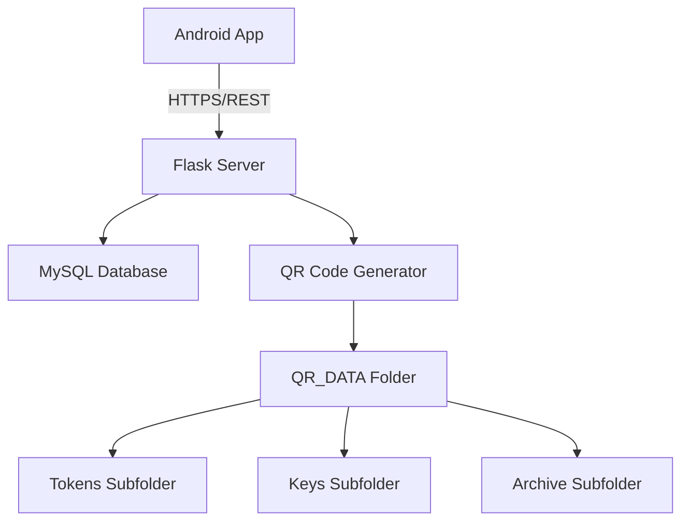

# IntelliAttend Network Documentation

## Table of Contents
1. [Overview](#overview)
2. [System Architecture](#system-architecture)
3. [Network Protocols](#network-protocols)
4. [Security Implementation](#security-implementation)
5. [API Endpoints](#api-endpoints)
6. [Data Flow](#data-flow)
7. [Connection Process](#connection-process)
8. [Error Handling](#error-handling)
9. [Performance Considerations](#performance-considerations)

## Overview

The IntelliAttend system implements a secure, multi-factor authentication attendance system that combines QR code scanning, biometric verification, GPS location tracking, WiFi data collection, and Bluetooth proximity detection. The system consists of a mobile application (Android) and a backend server (Flask/Python) that communicate over HTTPS.

## System Architecture

### Components
1. **Mobile Application (Android/Kotlin)**
   - Student-facing app for attendance marking
   - Collects biometric, GPS, WiFi, and Bluetooth data
   - Scans dynamic QR codes from SmartBoard display
   - Communicates with backend server via REST API

2. **Backend Server (Flask/Python)**
   - Manages authentication and session handling
   - Generates dynamic QR codes with 5-second refresh intervals
   - Processes attendance requests with multi-factor verification
   - Stores attendance records in MySQL database
   - Provides administrative interfaces for faculty

3. **Database (MySQL)**
   - Stores student, faculty, class, and attendance data
   - Maintains session and QR code information
   - Tracks device registrations and verification records

4. **QR Code Generation System**
   - Centralized QR_DATA folder structure
   - Dynamic QR code generation with security tokens
   - Automatic refresh every 5 seconds for 2 minutes

### Network Diagram


## Network Protocols

### HTTPS/TLS
- **Protocol**: HTTPS (HTTP over TLS 1.2+)
- **Port**: 5002 (development), 443 (production)
- **Certificate**: Self-signed for development, CA-signed for production
- **Cipher Suites**: Modern secure suites (AES-256-GCM, ECDHE)
- **Key Exchange**: ECDHE for perfect forward secrecy

### HTTP/1.1
- **Connection**: Keep-alive for performance
- **Content-Type**: application/json for API requests
- **Character Encoding**: UTF-8
- **Compression**: GZIP for large responses

### WebSocket (Future Enhancement)
- **Purpose**: Real-time notifications and updates
- **Implementation**: Socket.IO or native WebSocket
- **Use Cases**: Live attendance updates, session status changes

## Security Implementation

### Authentication
1. **JWT Tokens**
   - **Algorithm**: HS256 (HMAC with SHA-256)
   - **Expiration**: 1 hour for access tokens
   - **Claims**: User ID, user type (student/faculty), issued at, expiration
   - **Storage**: HTTP-only, secure cookies on web clients; SharedPreferences on mobile

2. **Session Management**
   - **Server-Side**: Database-stored session information
   - **Client-Side**: Token-based stateless authentication
   - **Timeout**: Automatic logout after inactivity

### Data Encryption
1. **In Transit**
   - **HTTPS/TLS**: All communication encrypted
   - **Certificate Pinning**: Mobile app validates server certificate
   - **API Keys**: Never transmitted in requests

2. **At Rest**
   - **Passwords**: Bcrypt hashing with salt
   - **Sensitive Data**: AES-256 encryption for device information
   - **QR Data**: HMAC-SHA256 signed payloads

### API Security
1. **Rate Limiting**
   - **Login Attempts**: 5 attempts per 15 minutes
   - **Attendance Requests**: 10 requests per minute per user
   - **QR Generation**: 1 session per faculty at a time

2. **Input Validation**
   - **Server-Side**: Strict validation of all inputs
   - **Client-Side**: Pre-validation for better UX
   - **Sanitization**: SQL injection prevention, XSS protection

3. **CORS Policy**
   - **Allowed Origins**: Configurable whitelist
   - **Methods**: GET, POST, PUT, DELETE
   - **Headers**: Authorization, Content-Type, X-Requested-With

## API Endpoints

### Authentication Endpoints

#### Student Login
- **Endpoint**: `POST /api/student/login`
- **Request Body**:
  ```json
  {
    "email": "student@example.com",
    "password": "password123"
  }
  ```
- **Response**:
  ```json
  {
    "success": true,
    "access_token": "eyJhbGciOiJIUzI1NiIsInR5cCI6IkpXVCJ9...",
    "student": {
      "studentId": 123,
      "studentCode": "STU00123",
      "firstName": "John",
      "lastName": "Doe",
      "email": "student@example.com",
      "program": "Computer Science",
      "yearOfStudy": 2
    }
  }
  ```

#### Faculty Login
- **Endpoint**: `POST /api/faculty/login`
- **Request Body**:
  ```json
  {
    "email": "faculty@example.com",
    "password": "password123"
  }
  ```
- **Response**:
  ```json
  {
    "success": true,
    "access_token": "eyJhbGciOiJIUzI1NiIsInR5cCI6IkpXVCJ9...",
    "faculty": {
      "faculty_id": 456,
      "name": "Dr. Jane Smith",
      "email": "faculty@example.com",
      "department": "Computer Science"
    }
  }
  ```

#### Logout
- **Endpoint**: `POST /api/student/logout` or `POST /api/faculty/logout`
- **Headers**: `Authorization: Bearer <token>`
- **Response**:
  ```json
  {
    "success": true,
    "message": "Logged out successfully"
  }
  ```

### Attendance Endpoints

#### Generate OTP (Faculty)
- **Endpoint**: `POST /api/faculty/generate-otp`
- **Headers**: `Authorization: Bearer <faculty_token>`
- **Response**:
  ```json
  {
    "success": true,
    "otp": "123456",
    "expires_at": "2023-10-15T14:30:00Z",
    "message": "OTP generated successfully"
  }
  ```

#### Verify OTP and Start Session
- **Endpoint**: `POST /api/verify-otp`
- **Request Body**:
  ```json
  {
    "otp": "123456",
    "class_id": 789
  }
  ```
- **Response**:
  ```json
  {
    "success": true,
    "session_id": 101,
    "message": "Attendance session started",
    "expires_at": "2023-10-15T14:32:00Z"
  }
  ```

#### Submit Attendance (Student)
- **Endpoint**: `POST /api/attendance/scan`
- **Headers**: `Authorization: Bearer <student_token>`
- **Request Body**:
  ```json
  {
    "qr_data": "{\"session_id\":101,\"token\":\"abc123\",\"timestamp\":1697380000}",
    "biometric_verified": true,
    "location": {
      "latitude": 40.7128,
      "longitude": -74.0060,
      "accuracy": 15.5
    },
    "bluetooth": {
      "rssi": -65,
      "devices": ["00:11:22:33:44:55"]
    },
    "device_info": {
      "deviceId": "android-xyz123",
      "deviceName": "Samsung Galaxy S21",
      "osVersion": "Android 12",
      "appVersion": "1.0.0"
    }
  }
  ```
- **Response**:
  ```json
  {
    "success": true,
    "status": "present",
    "verification_score": 0.95,
    "verifications": {
      "biometric": true,
      "location": true,
      "bluetooth": true
    },
    "message": "Attendance recorded successfully"
  }
  ```

#### Get Attendance History
- **Endpoint**: `GET /api/attendance/history`
- **Headers**: `Authorization: Bearer <student_token>`
- **Query Parameters**: `limit=50`
- **Response**:
  ```json
  {
    "success": true,
    "records": [
      {
        "record_id": 202,
        "session_id": 101,
        "scan_timestamp": "2023-10-15T14:15:30Z",
        "verification_score": 0.95,
        "status": "present",
        "class_name": "Computer Science 101"
      }
    ]
  }
  ```

### Session Management Endpoints

#### Get Current Sessions
- **Endpoint**: `GET /api/session/current`
- **Headers**: `Authorization: Bearer <student_token>`
- **Response**:
  ```json
  {
    "success": true,
    "sessions": [
      {
        "session_id": 101,
        "class_name": "Computer Science 101",
        "faculty_name": "Dr. Jane Smith",
        "start_time": "2023-10-15T14:00:00Z",
        "end_time": "2023-10-15T14:30:00Z"
      }
    ]
  }
  ```

#### Get Session Status
- **Endpoint**: `GET /api/session/{sessionId}/status`
- **Headers**: `Authorization: Bearer <student_token>`
- **Response**:
  ```json
  {
    "success": true,
    "session": {
      "session_id": 101,
      "status": "active",
      "qr_expires_at": "2023-10-15T14:15:05Z"
    }
  }
  ```

#### Stop Session (Faculty)
- **Endpoint**: `POST /api/session/stop/{sessionId}`
- **Headers**: `Authorization: Bearer <faculty_token>`
- **Response**:
  ```json
  {
    "success": true,
    "message": "Session stopped successfully"
  }
  ```

### Device Management Endpoints

#### Register Device
- **Endpoint**: `POST /api/device/register`
- **Headers**: `Authorization: Bearer <student_token>`
- **Request Body**:
  ```json
  {
    "deviceUuid": "android-xyz123",
    "deviceName": "Samsung Galaxy S21",
    "deviceType": "android",
    "deviceModel": "SM-G991U",
    "osVersion": "Android 12",
    "appVersion": "1.0.0"
  }
  ```
- **Response**:
  ```json
  {
    "success": true,
    "message": "Device registered successfully"
  }
  ```

#### Update Device
- **Endpoint**: `PUT /api/device/update`
- **Headers**: `Authorization: Bearer <student_token>`
- **Request Body**:
  ```json
  {
    "deviceUuid": "android-xyz123",
    "deviceName": "Samsung Galaxy S21",
    "deviceType": "android",
    "deviceModel": "SM-G991U",
    "osVersion": "Android 13",
    "appVersion": "1.1.0"
  }
  ```
- **Response**:
  ```json
  {
    "success": true,
    "message": "Device updated successfully"
  }
  ```

## Data Flow

### 1. Student Authentication Flow
1. Student opens app and enters credentials
2. App sends POST request to `/api/student/login`
3. Server validates credentials against database
4. Server generates JWT token with student claims
5. Server returns token and student profile
6. App stores token in SharedPreferences
7. App uses token for subsequent API requests

### 2. Attendance Session Flow
1. Faculty logs in and generates OTP
2. Faculty enters OTP in SmartBoard interface
3. Server verifies OTP and creates attendance session
4. Server starts QR code generation process
5. QR codes are generated every 5 seconds for 2 minutes
6. QR codes are stored in centralized QR_DATA folder
7. SmartBoard displays current QR code via web interface

### 3. Attendance Marking Flow
1. Student scans QR code using mobile app
2. App collects biometric, GPS, WiFi, and Bluetooth data
3. App sends attendance request to `/api/attendance/scan`
4. Server validates QR data and session status
5. Server verifies multi-factor authentication data
6. Server calculates verification score
7. Server creates attendance record in database
8. Server returns success/failure response to app

### 4. Data Verification Process
1. **Biometric Verification**
   - App captures fingerprint/face scan
   - Verification performed on device
   - Result included in attendance request

2. **Location Verification**
   - App collects GPS coordinates
   - Server compares with classroom geofence
   - Accuracy threshold applied (50 meters)

3. **WiFi Verification**
   - App collects current WiFi network info
   - Server validates network characteristics
   - Signal strength and network name checked

4. **Bluetooth Verification**
   - App scans for registered Bluetooth devices
   - RSSI threshold applied (-70 dBm)
   - Proximity determined by signal strength

## Connection Process

### Initial Connection
1. **DNS Resolution**
   - Mobile app resolves server domain name
   - DNS cache used for subsequent requests

2. **TLS Handshake**
   - ClientHello with supported cipher suites
   - ServerHello with selected cipher suite
   - Certificate exchange and validation
   - Key exchange and session establishment

3. **HTTP Connection**
   - HTTP/1.1 persistent connection established
   - Connection kept alive for multiple requests
   - Timeout after 30 seconds of inactivity

### API Request Flow
1. **Request Preparation**
   - JWT token added to Authorization header
   - Request body serialized as JSON
   - Content-Type set to application/json

2. **Request Transmission**
   - HTTP request sent over TLS connection
   - Request includes method, headers, and body
   - Connection timeout: 30 seconds
   - Read timeout: 30 seconds

3. **Server Processing**
   - Middleware validates JWT token
   - Request routed to appropriate handler
   - Database queries executed
   - Response prepared and serialized

4. **Response Handling**
   - HTTP response received by mobile app
   - Response parsed and validated
   - UI updated with response data
   - Errors handled and displayed to user

### Connection Pooling
1. **OkHttp Client**
   - Connection pool with max 5 idle connections
   - 5-minute idle timeout
   - Automatic retry on connection failures

2. **Database Connections**
   - SQLAlchemy connection pool
   - Max 20 connections with 30 overflow
   - 280-second connection recycle

## Error Handling

### Network Errors
1. **Connection Timeout**
   - Retry up to 3 times with exponential backoff
   - Display user-friendly error message
   - Log error for debugging

2. **DNS Resolution Failure**
   - Check internet connectivity
   - Display "No Internet" message
   - Suggest checking network settings

3. **SSL/TLS Errors**
   - Certificate validation failures
   - Outdated security protocols
   - Alert user and log security event

### HTTP Errors
1. **400 Bad Request**
   - Invalid request parameters
   - Malformed JSON
   - Display validation errors

2. **401 Unauthorized**
   - Expired or invalid JWT token
   - Redirect to login screen
   - Clear local session data

3. **403 Forbidden**
   - Insufficient permissions
   - Role-based access control
   - Display permission error

4. **404 Not Found**
   - Invalid API endpoint
   - Missing resources
   - Log and report to developers

5. **500 Internal Server Error**
   - Server-side exceptions
   - Database connection issues
   - Display generic error message
   - Log detailed error information

### Application Errors
1. **QR Code Validation**
   - Expired QR tokens
   - Invalid session IDs
   - Tampered QR data

2. **Biometric Failures**
   - Sensor errors
   - Authentication failures
   - Hardware incompatibility

3. **Location Services**
   - GPS unavailable
   - Location permissions denied
   - Poor accuracy readings

4. **Bluetooth Issues**
   - Bluetooth disabled
   - Scanning failures
   - Device not found

## Performance Considerations

### Mobile App Optimization
1. **Network Requests**
   - Use of Retrofit for efficient HTTP client
   - GSON for fast JSON serialization
   - OkHttp for connection pooling
   - Request caching where appropriate

2. **Data Caching**
   - Student profile cached locally
   - Attendance history cached
   - QR scanning results cached temporarily

3. **Background Processing**
   - Coroutines for asynchronous operations
   - Thread pooling for data collection
   - Efficient resource management

### Server Optimization
1. **Database Performance**
   - Indexes on frequently queried columns
   - Connection pooling
   - Query optimization
   - Read replicas for reporting

2. **QR Code Generation**
   - Background threading
   - Memory-efficient image processing
   - File system optimization
   - Cleanup of old files

3. **API Performance**
   - Request/response compression
   - CDN for static assets
   - Load balancing for high availability
   - Caching of frequently accessed data

### Scalability
1. **Horizontal Scaling**
   - Stateless API services
   - Load balancer distribution
   - Database sharding for large datasets

2. **Vertical Scaling**
   - Database optimization
   - Memory and CPU allocation
   - Storage expansion

3. **Microservices Architecture**
   - Separation of concerns
   - Independent deployment
   - Service-to-service communication

## Monitoring and Logging

### Mobile App
1. **Analytics**
   - Usage statistics
   - Crash reporting
   - Performance metrics

2. **Logging**
   - Debug logs for development
   - Error logs for production
   - Network request logging

### Server
1. **Application Logs**
   - Request/response logging
   - Error tracking
   - Performance metrics

2. **System Monitoring**
   - CPU and memory usage
   - Database performance
   - Network traffic

3. **Security Monitoring**
   - Failed login attempts
   - Suspicious activity detection
   - Audit trails

This documentation provides a comprehensive overview of the network architecture, protocols, security measures, and data flows within the IntelliAttend system. It serves as a reference for developers, system administrators, and security auditors working with the platform.