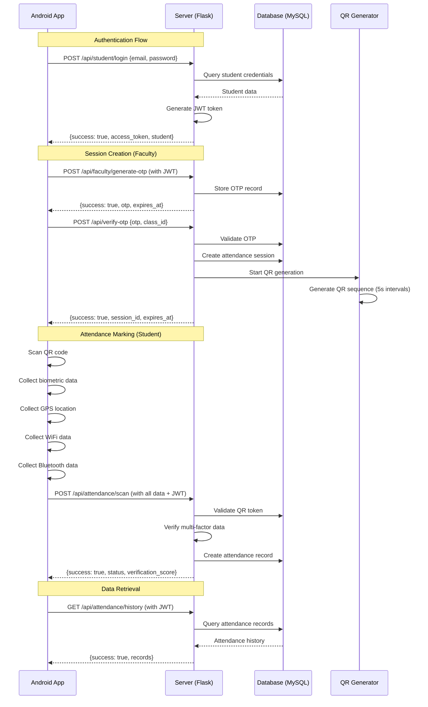

# IntelliAttend Network Flow Documentation

## Overview
This document details the network communication flow between the IntelliAttend mobile app and server, including all major interactions and data exchanges.

## Network Flow Diagram

## Detailed Flow Explanations

### 1. Student Authentication Flow

1. **Mobile App Request**
   - User enters email and password
   - App sends POST request to `/api/student/login`
   - Request body: `{"email": "student@example.com", "password": "password123"}`

2. **Server Processing**
   - Server receives request and validates credentials
   - Queries database for student record
   - Verifies password hash using bcrypt
   - Generates JWT token with student claims

3. **Response**
   - Server returns JWT token and student profile
   - App stores token in SharedPreferences
   - App navigates to main dashboard

### 2. Faculty Session Creation Flow

1. **OTP Generation**
   - Faculty logs in and requests OTP generation
   - App sends POST request to `/api/faculty/generate-otp`
   - Server creates 6-digit OTP with 5-minute expiry
   - OTP stored in database with faculty association

2. **Session Initialization**
   - Faculty enters OTP in SmartBoard interface
   - SmartBoard sends POST request to `/api/verify-otp`
   - Server validates OTP against database
   - Creates new attendance session record
   - Starts QR code generation process

3. **QR Code Generation**
   - Server initializes QR generation thread
   - Generates new QR code every 5 seconds
   - Each QR contains session ID, timestamp, and security token
   - QR images saved to centralized QR_DATA folder
   - SmartBoard polls for current QR via `/api/qr/current/{session_id}`

### 3. Student Attendance Flow

1. **Data Collection**
   - Student opens app and scans displayed QR code
   - App collects biometric verification (fingerprint/face)
   - App collects GPS location data
   - App collects current WiFi network information
   - App scans for registered Bluetooth devices

2. **Attendance Submission**
   - App packages all data into attendance request
   - Sends POST request to `/api/attendance/scan`
   - Includes JWT token in Authorization header
   - Request contains QR data and all verification data

3. **Server Processing**
   - Validates JWT token
   - Parses and validates QR data
   - Verifies session is active and not expired
   - Processes multi-factor verification data
   - Calculates verification score (0.0-1.0)
   - Creates attendance record in database

4. **Response**
   - Server returns success/failure status
   - Includes verification breakdown and score
   - App displays result to student

### 4. Data Retrieval Flow

1. **Attendance History**
   - Student requests attendance history
   - App sends GET request to `/api/attendance/history`
   - Server queries database for student's records
   - Returns paginated attendance history

2. **Current Sessions**
   - Student checks for active sessions
   - App sends GET request to `/api/session/current`
   - Server returns list of active sessions
   - App displays available sessions for attendance

## Security Measures

### HTTPS/TLS
- All communication encrypted with TLS 1.2+
- Certificate validation on mobile app
- HTTP Strict Transport Security (HSTS)

### JWT Token Security
- HS256 algorithm for token signing
- 1-hour expiration for access tokens
- Automatic token refresh mechanism
- Token revocation on logout

### Data Validation
- Server-side validation of all inputs
- SQL injection prevention
- Cross-site scripting (XSS) protection
- Rate limiting for API endpoints

### QR Code Security
- Cryptographically secure token generation
- 5-second refresh intervals prevent sharing
- HMAC-SHA256 signed payloads
- Server-side validation of QR data

## Error Handling

### Network Errors
- Automatic retry with exponential backoff
- Connection timeout handling
- Offline mode for data collection
- Graceful degradation of features

### Authentication Errors
- Token expiration detection
- Automatic redirect to login
- Session recovery mechanisms
- Secure token storage

### Data Validation Errors
- Detailed error messages for invalid data
- Client-side pre-validation
- User-friendly error display
- Logging of validation failures

## Performance Optimization

### Connection Management
- HTTP/1.1 keep-alive connections
- Connection pooling on both client and server
- Request/response compression
- Efficient JSON serialization

### Caching Strategy
- Student profile caching
- Attendance history caching
- QR code image caching
- Database query result caching

### Asynchronous Processing
- Background threads for QR generation
- Non-blocking I/O operations
- Coroutine-based async processing
- Efficient resource utilization

This network flow documentation provides a comprehensive view of how data moves through the IntelliAttend system, from initial authentication to attendance marking and data retrieval.